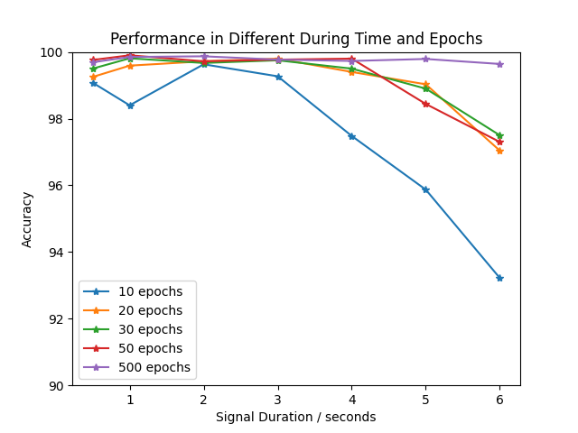

# amblyopia-ESTCNN
This repo is an implementation to classify amblyopia using ESTCNN model. <a href = "https://doi.org/10.1109/TNNLS.2018.2886414">ESTCNN</a> is a CNN model to extract features of EEG data.

The dataset is obtained from some hospital in Beijing and it is not publicized. There are 80 testees in total and the task is a 4-class classification task, including N(normal),L(Left),R(right),B(binoculus). The sample rate is fixed and it is 500hz. There are 17 channels in total. 

We dived into twe series of experiments. 
One of them is the impact of window size(the length of the signal) on the model. We seperate data into seven lengths, 250-3000(duration time 0.25-3 seconds).

The other is the impact of the order of electrodes on the model, including five orders: order based on Shannon Entropy, order based on 10-20 system, order based on electrodes of left and right brains and order based on the power of electrodes. 

<table>
    <tr>
        <th>Order</th>
        <th>Accuracy</th>
    </tr>
    <tr>
    <th>Shannon Entropy</th><th>99.73</th>
    </tr>
    <tr>
    <th>10-20 System</th><th>99.63</th>
    </tr>
    <tr>
    <th>Power</th><th>98.45</th>
    </tr>
    <tr>
    <th>Left-Right</th><th>98.75</th>
    </tr>
</table>